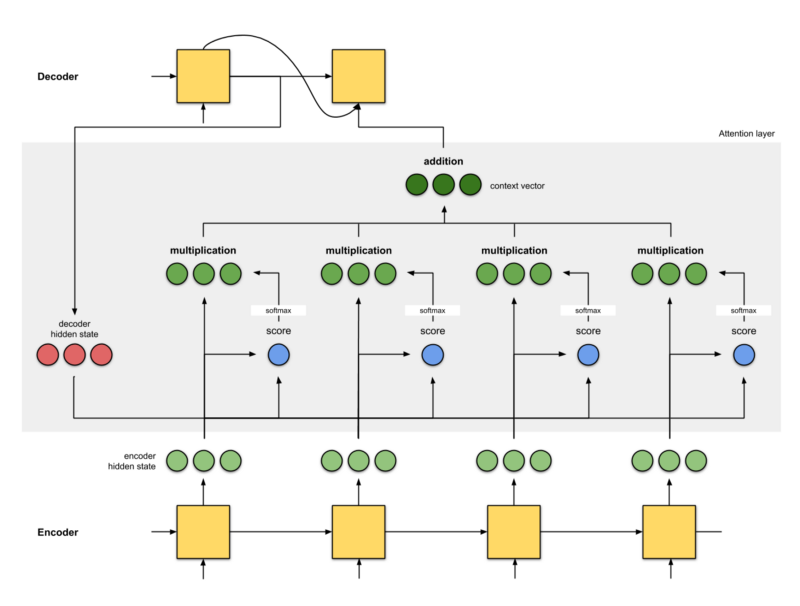

# Attention

## Idea

The key idea behind attention is to give the decoder in an encoder decoder architecture relevant context informations.
This is done by calculating an attention vector also known as context vector.
The decoder gets the previous hidden states as well the attention vector as input and therefore knows on what to focus given the encoding sequence.

## Improvement

In comparison to classic encoder decoder approaches, with attention the model is able to focus on useful parts of the input over longer sequences.

## Concept

<!-- $a^{<t'>}$: activation vector for timestep *t* -->
: activation vector for timestep *t*

<!-- $\alpha^{<t,t'>}$: amount of *attention* $\hat{y}^{<t>}$ should pay to $a^{<t'>}$ -->
: amount of *attention*  should pay to 

<!-- $e^{<t,t'>}$: alignment score (can be trained with a single layer feed forward network) -->
: alignment score (can be trained with a single layer feed forward network)

<!-- $c^{<t>}$: context vector as input to the decoder -->
: context vector as input to the decoder

### Calculus

<!-- $a^{<t'>}=(\overrightarrow{a}^{<t'>},\overleftarrow{a}^{<t'>})$ -->
)

<!-- $\sum_{t'}\alpha^{<1,t'>}=1$ -->

<!-- $\alpha^{<t,t'>}=\frac{\exp(e^{<t,t'>})}{\sum_{t'=1}^{Tx}\exp(e^{<t,t'>})}$ -->
}{\sum_{t'=1}^{Tx}\exp(e^{<t,t'>})})

<!-- * using Softmax to ensure $\sum\alpha=1$ -->
* using Softmax to ensure 

<!-- $e^{<t,t'>}=g_t(W_ya^{<t>}+b_y)$ -->
)
* simple linear network - see below scoring functions

<!-- $c^{<t>}=\sum_{t'}\alpha^{<1,t'>}a^{<t>}$ -->

 - [Reference](https://towardsdatascience.com/attn-illustrated-attention-5ec4ad276ee3)

### Scoring Functions
 
 - [Reference](https://lilianweng.github.io/lil-log/2018/06/24/attention-attention.html#a-family-of-attention-mechanisms)

### Approaches

1. Bahdanau et. al (2015)
   1. using additive/concat scoring function
   2. input to the next decoder step is the concatenation between the output from the previous decoder time step and context vector from the current time step
2. Luong et. al (2015)
   1. using different scoring functions:
      1. additive/concat
      2. dot product
      3. location-based
      4. general
   2. input to the next decoder step is the output of a feed-forward neural network which gets the concatenation of the previous decoder time step and context vector from the current time step

## Evaluation

## Production

## References

1. [Attn: Illustrated Attention](https://towardsdatascience.com/attn-illustrated-attention-5ec4ad276ee3)
2. [Attention? Attention!](https://lilianweng.github.io/lil-log/2018/06/24/attention-attention.html#a-family-of-attention-mechanisms)
3. [Bahdanau et. al, 2015 - Neural Machine Translation by Jointly Learning to Align and Translate](https://arxiv.org/abs/1409.0473)
4. [Luong et. al, 2015 - Effective Approaches to Attention-based Neural Machine Translation](https://arxiv.org/abs/1508.04025)
5. [Vaswani et. al, 2017 - Attention Is All You Need](https://arxiv.org/abs/1706.03762)
