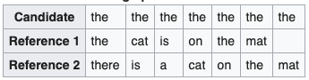

# BLEU

## Idea

BLEU (bilingual evaluation understudy) is an algorithm for evaluating the quality of text which has been machine-translated from one natural language to another. (Wikipedia)
Since there are possibly multiple good translations to one input, the question remains which is the best one.
BLEU provides a metric to compute a score wheter the generated words are in the references.

## Improvement

## Concept

In general the BLEU metric counts the generated words in the translation and compares them to the occurrences in the references.

* Generated words = machine output
* References = human labels

**Precision:**

<!-- $prec=\frac{\sum\:occurrences\:in\:ref}{\sum\#words\:of\:output}$ -->

**Modified precision:**

<!-- $mod\_prec=\frac{\sum\:clipped\:occurrences\:in\:ref}{\sum\#words\:of\:output}$ -->

<!-- $prec = \frac{7}{7} \qquad mod\_prec = \frac{2}{7}$ -->

**N-gram precision:**

<!-- $P_n = \frac{\sum_{n-gram\in\hat{y}}count_{clip}(n-gram)}{\sum_{n-gram\in\hat{y}}count(n-gram)}$ -->
}{\sum_{n-gram\in\hat{y}}count(n-gram)})

* if machine translation equals one ref -> P = 1.0

**BLEU Score:**

<!-- * $P_n$ = n-gram
  * compute for $P_1, P_2, P_3, P_4$ -->
*  = n-gram
  * compute for 

<!-- $BP \exp(\frac{1}{4}\sum^4_{n=1}P_n)$ -->
)

where 

<!-- $BP \{ {{1 \quad\:if\:out\:length>ref\:length}\atop{\exp(1-out\:length/ref\:length)}}$ -->

* BP: penalizes score for short sentences
  * short sentences tend to have good scores, because of the number of word occurrences
  
The BLEU metric is useful for NMT and Image Captioning, but bad for speech recognition (mostly one ground truth).

## Evaluation

## Production

## References

1. [BLEU Wikipedia](https://en.wikipedia.org/wiki/BLEU)
