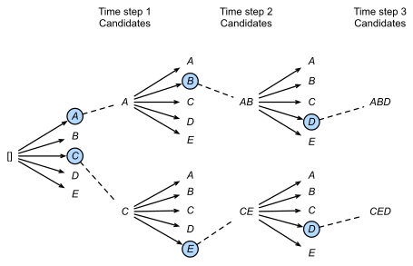

# BEAM Search

## Idea

The key idea of *Beam Search* is to sample the most likely values for each time step and use them as input for the further.
Similar to [greedy search](../greedy-search/greedy-search.md) the *Beam Search* algorithm is commonly used in encoder decoder architectures.
However, the main difference is in not only using the most likey word, but the **B** most likely ones.
Based on those different parallel computations will be made to calculate the further best values with respect to the maximum probability of the prediction.

## Improvement

In comparison to [greedy search](../greedy-search/greedy-search.md) the beam search algorithm does not prefer common values since several likely will be selected for further calculations.

## Concept

1. Define the **Beam width:** 
   1. If you choose to define a large *B* you obtain better but slower results
   2. A small *B* will result worse but faster

<!-- Pick the most likely *B* values for the first timestep $\hat{y}^{<1>}$ -->
2. Pick the most likely *B* values for the first timestep )

<!-- 3. Based on the first *B* values, pick the next *B* most likely ones $P(\hat{y}^{<2>}|x,\hat{y}^{<1>})$ -->
3. Based on the first *B* values, pick the next *B* most likely ones )
   
<!-- 4. $P(\hat{y}^{<1>}, \hat{y}^{<2>}|x) = P(\hat{y}^{<1>}|x)P(\hat{y}^{<2>}|x,\hat{y}^{<1>})$ (you have *B* copies of your network) -->
4. =P(\hat{y}^{<1>}|x)P(\hat{y}^{<2>}|x,\hat{y}^{<1>})$) (you have *B* copies of your network)

5. Repeat picking *B* values
   1. In each iteration only *B* values will propagate
   2. *B* values over all results

 - [Reference](https://d2l.ai/chapter_recurrent-neural-networks/beam-search.html)

Refinement:

<!-- 1. $argmax_y=\prod^{T_y}_{t=1}{P(y^{<t>}|x,y^{<1>},...,y^{<t-1>})}$  -->
1. })
   1. Prefers short predictions
   2. Rounding errors/ underflow
<!-- 2. $argmax_y=\sum^{T_y}_{t=1}{logP(y^{<t>}|x,y^{<1>},...,y^{<t-1>})}$  -->
3. })
   1. Insert log -> Sum of log
   2. Numerical more stable
   3. Prefers short predictions
<!-- 4. $\frac{1}{T^\alpha_y}\sum^{T_y}_{t=1}{logP(y^{<t>}|x,y^{<1>},...,y^{<t-1>})}$  -->
5. })
   <!-- 1. Where $\alpha=0.7$ (Normalisation factor) -->
   2. Where  (normalization factor)

## Evaluation

<!-- Error Analysis: $P(y^{*}|x) vs. P(\hat{y}|x)$ -->
Error Analysis: ) vs. )

* where : human prediction
* and : machine prediction

**Case 1:**

) > )

* Beam search is at faul -> change *B width*

**Case 2:**

) <= )

* RNN is at fault -> change architecture

## Production

## References

1. [Dive into DeepLearning](https://d2l.ai/chapter_recurrent-neural-networks/beam-search.html)
2. [Beam Search — A Search Strategy](https://hackernoon.com/beam-search-a-search-strategy-5d92fb7817f)
